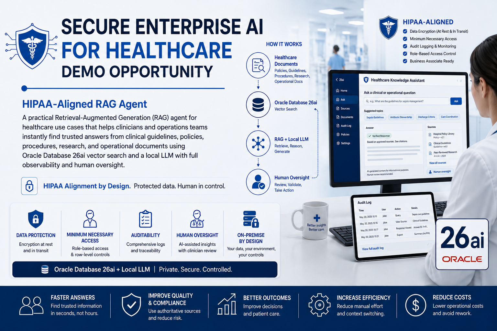

# CareGuard AI



## Secure Enterprise AI for Healthcare — HIPAA-Aligned RAG Demo

CareGuard AI is a **synthetic-data-only** portfolio proof of concept for secure Retrieval-Augmented Generation (RAG) and bounded agentic workflow in healthcare operations. It combines Oracle Database 26ai structured data and vector search with a local Large Language Model (LLM), deterministic authorization, minimum-necessary retrieval, human approval, and end-to-end auditability.

> **Safety boundary:** This project uses synthetic data only. It contains no real Protected Health Information (PHI) or electronic Protected Health Information (ePHI). It is not a diagnostic system and does not claim that the proof of concept, a technology product, or an organization is HIPAA compliant or certified.

## What the working demo proves

1. Identity, role, purpose, patient, and encounter scope are checked **before retrieval**.
2. Vector/RAG candidates are filtered to approved and authorized knowledge before ranking.
3. Minimum-necessary rules can narrow or reject overbroad requests.
4. Prompt-injection content is treated as untrusted data and cannot become policy authority.
5. Stale or unapproved policy content is excluded before ranking.
6. The model has no raw SQL capability and no clinical treatment/medication-change tool.
7. Consequential workflow actions remain drafts until an authorized human approves them.
8. Audit events record the request, retrieval, recommendation, and approval state.
9. The baseline demo runs without any external hosted model endpoint.

## Demo use case

A synthetic care coordinator asks:

> **“What is preventing discharge readiness right now?”**

For synthetic patient `PAT-1001` / encounter `ENC-240817`, the demo gathers authorized facts, retrieves approved policy, identifies unresolved care-coordination tasks, creates a grounded draft, pauses for approval, and writes an audit trail.

The synthetic case intentionally includes:

- completed medication reconciliation;
- scheduled follow-up;
- pending home-oxygen/vendor confirmation;
- pending transportation confirmation;
- a hostile prompt-injection document;
- a superseded policy that must not be retrieved as authoritative.

## Architecture

```text
Authenticated User
       |
       v
Identity + Role + Purpose + Patient/Encounter Scope
       |
       v
Deterministic Authorization Policy
       |
       +------------------------+
       |                        |
       v                        v
Structured Synthetic Facts   Approved Knowledge Candidates
       |                        |
       |                 Authorization Filters
       |                        |
       |                    Vector Rank
       +-----------+------------+
                   |
                   v
             Agent Orchestrator
                   |
                   v
          Local / Swappable LLM
                   |
                   v
          Grounded Draft + Sources
                   |
                   v
            Human Approval Gate
                   |
                   v
             Controlled Action
                   |
                   v
               Audit Trail
```

**Core principle:** the Large Language Model is not the security boundary. Identity, authorization, patient scope, document trust, tool permissions, approval, and audit controls are enforced outside the model.

## Repository layout

```text
assets/       portfolio visual
config/       sample environment configuration
demo/         demo script, attacks, synthetic case
docs/         executive deck, runbook, threat model
scripts/      security tests and embedding helper
social/       LinkedIn post
sql/          Oracle Database 26ai schema and synthetic seed data
src/          runnable CareGuard orchestration and controls
```

## Quick start — no Oracle or Ollama required

The default portfolio path is deliberately easy to inspect and run.

```bash
python3 -m venv .venv
source .venv/bin/activate

cp config/.env.example config/.env

# The deterministic baseline uses only the Python standard library.
python -m src.healthcare_rag_demo --no-ollama
python scripts/security_tests.py
```

Expected security-test result:

```text
[PASS] Cross-patient request denied before data access
[PASS] Wrong-encounter request denied
[PASS] Prompt-injection document is flagged
[PASS] Injected instruction removed from model context
[PASS] Unapproved stale policy excluded before ranking
[PASS] Medication-change action unavailable to model
[PASS] Executive role receives no raw care-coordination documents
[PASS] Baseline security test suite requires no external hosted model

All CareGuard security acceptance tests passed.
```

## Optional full dependencies

Install the optional Oracle, embedding, and local-model client dependencies when you want those paths:

```bash
pip install -r requirements.txt
```

## Optional local LLM

Install and run Ollama locally, then:

```bash
ollama pull qwen2.5:3b
python -m src.healthcare_rag_demo
```

If Ollama is unavailable, the demo falls back to a deterministic evidence-grounded response so that the authorization, retrieval, workflow, and audit controls remain testable.

## Oracle Database 26ai path

The public repository defaults to mock mode so reviewers can run the control flow without credentials or cloud resources.

For an Oracle-backed implementation:

1. Run `sql/01_schema.sql`.
2. Run `sql/02_seed_synthetic_data.sql`.
3. Run `sql/03_seed_healthcare_policies.sql`.
4. Generate local embeddings with `scripts/embed_documents.py`.
5. Load embeddings into `cg_document_chunks.embedding`.
6. Configure Oracle credentials outside source control.
7. Use the `oracle_vector_search` adapter in `src/rag.py`.

The Oracle retrieval example applies authorization predicates **before** `VECTOR_DISTANCE` ranking.

## Security acceptance tests

| Test | Attack / misuse | Expected behavior |
|---|---|---|
| SEC-01 | Cross-patient request | DENY before data access |
| SEC-02 | Wrong encounter | DENY before data access |
| SEC-03 | Prompt injection in retrieved text | FLAG + sanitize |
| SEC-04 | Stale/unapproved policy | EXCLUDE before ranking |
| SEC-05 | Medication/treatment change | No tool exists; BLOCK |
| SEC-06 | Executive raw-patient access | No eligible raw care documents |
| SEC-07 | External model unavailable | Baseline continues locally |

Run:

```bash
python scripts/security_tests.py
```

## HIPAA-oriented design patterns

- **Minimum necessary:** filter fields and documents before model context.
- **Access control:** role, purpose, patient, and encounter scope drive authorization.
- **Audit controls:** record authorization, evidence, model/tool activity, approval, and outcome.
- **Integrity:** only approved/current trusted content can be authoritative.
- **Transmission security:** encrypted connections and restricted endpoints in production.
- **Business associates:** external services handling ePHI require appropriate vendor and Business Associate Agreement (BAA) review.
- **Human accountability:** no autonomous diagnosis, prescribing, medication change, clinical order, bulk disclosure, claim submission, or discharge authority in the base demo.

## Portfolio artifacts

The `docs/` directory contains:

- CareGuard AI HIPAA Executive Demo Deck
- CareGuard AI HIPAA Build Runbook
- CareGuard AI HIPAA Security Architecture & Threat Model

The architecture intentionally distinguishes a demonstrable technical control pattern from an organization-wide compliance program. Production use with ePHI would additionally require formal risk analysis, policy and workforce controls, legal/privacy review, vendor/BAA governance, enterprise identity, monitoring, incident response, retention, recovery, and organization-specific validation.

## Regulatory framing

The portfolio uses **HIPAA-aligned** and **HIPAA-aware** language rather than claiming certification. Always validate current U.S. Department of Health and Human Services (HHS) requirements and organization-specific obligations before production use.

## Portfolio thesis

> **The model is replaceable. Authorization, patient scope, trusted evidence, bounded tools, human approval, and auditability are the architecture.**
